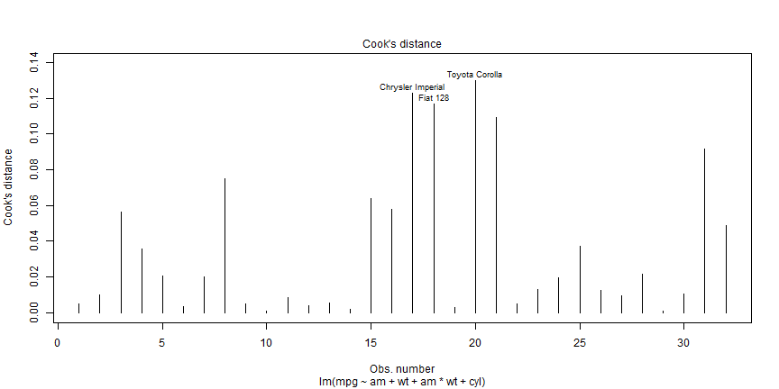
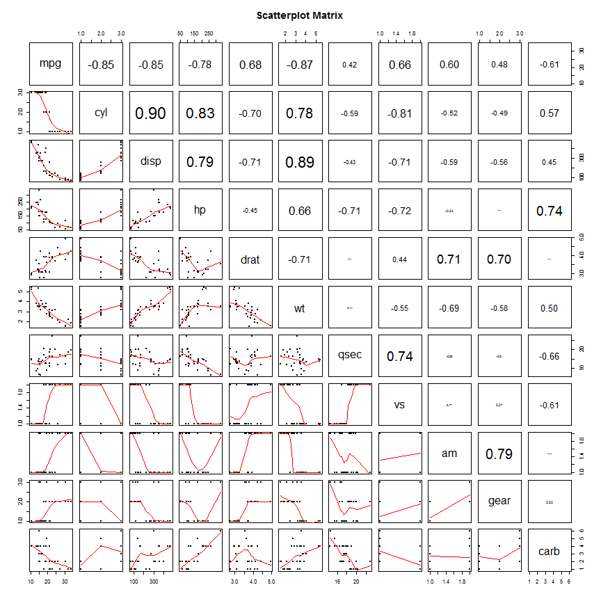

The Effects of Transmission Type on MPG
=========================================================

## Executive Summary
I can say with absolute certainty that manual transition increases MPG more than having an automatic transition. In every valid model I ran manual transmission variable was always positive.  The degree of how much a manual transmission is better than automatic varied throughout the modeling process.  In the final model, manual transmission shows as it can increase MPG by 11.6 MPG and more so for lighter cars.

The approach I have taken in this analysis is to include transmission type even though one can show a slightly superior model without it.  However, a superior model without transmission type isn't the point of this exercises and more importantly doesn't answer the main questions.


## Final Model
The model has a 85% Adjusted R-Squared.  It contains three variables (transmission type, weight, & number of cylinders) along with transmission & weight interaction.  All variables are significant to the 10% level and the model's residual is normal as tested with the Shapiro normality test.

The manual type transmission has a coefficient of 11.569 mean than having a manual transmission increases MPG by that amount.  We also point out the fact of the interaction variable with manual transmission vs. weight as negative meaning the higher the weight the less the MPG.  This means manual transmission of effect decreases by about 4 miles for every 1,000 lbs.

The model also includes weight and number of cylinders both of which are negative meaning the higher the weight the lower the MPG and same for cylinders.

Finally, residual plot are ok but not great.


```

Call:
lm(formula = mpg ~ am + wt + am * wt + cyl, data = mtcars)

Residuals:
   Min     1Q Median     3Q    Max 
-3.541 -1.538 -0.678  1.316  5.283 

Coefficients:
            Estimate Std. Error t value Pr(>|t|)    
(Intercept)   29.775      2.840   10.48  7.9e-11 ***
amManual      11.569      4.088    2.83   0.0089 ** 
wt            -2.399      0.844   -2.84   0.0086 ** 
cyl6          -2.710      1.357   -2.00   0.0565 .  
cyl8          -4.776      1.556   -3.07   0.0050 ** 
amManual:wt   -4.068      1.397   -2.91   0.0073 ** 
---
Signif. codes:  0 '***' 0.001 '**' 0.01 '*' 0.05 '.' 0.1 ' ' 1

Residual standard error: 2.3 on 26 degrees of freedom
Multiple R-squared:  0.877,	Adjusted R-squared:  0.854 
F-statistic: 37.2 on 5 and 26 DF,  p-value: 4.74e-11
```

```

	Shapiro-Wilk normality test

data:  final_model$residuals
W = 0.9448, p-value = 0.1027
```

  

## The Modeling Process
### Exploratory Data Analysis
Pair-wise scatter plots and correlations charts are used.  Code is borrowed from http://gettinggeneticsdone.blogspot.com/2011/07/scatterplot-matrices-in-r.html.  Please see code and plot in appendix.

### Model Selection Process
The analysis starts with a simple regression model that includes transmission type.  Another two models get added to this simple model for each other variable involved; one with an extra variable besides transmission type and another with the interaction added.  Four statistics are gathered: Adjusted R-Sq, maximum p-value, transmission type coefficient value and the Shapiro normality test.  We then combine these statistics and output a table of results.  We select the model that satisfies highest adjusted R-Squared which satisfies a maximum p-value less than 10% significance level for all the variables and passes the normal residual test.

I then repeat the addition of extra variables and select the best model and proceed with similar to what I have done before.  If I can't find any better model than what we already have then we stop and perform a residual analysis to make sure we have a satisfactory model.
 
## Appendix
### Scatter Plots

```r
# Visualize Data
# Credit: http://gettinggeneticsdone.blogspot.com/2011/07/scatterplot-matrices-in-r.html
panel.cor <- function(x, y, digits=2, prefix="", cex.cor, ...) {
    usr <- par("usr"); on.exit(par(usr))
    par(usr = c(0, 1, 0, 1))
    r <- cor(x, y)
    txt <- format(c(r, 0.123456789), digits=digits)[1]
    txt <- paste(prefix, txt, sep="")
    if(missing(cex.cor)) cex.cor <- 0.8/strwidth(txt)
    text(0.5, 0.5, txt, cex = cex.cor * abs(r))
}

# Plot #2: same as above, but add loess smoother in lower and correlation in upper
pairs(~., data=mtcars, lower.panel=panel.smooth, upper.panel=panel.cor, pch=20, main="Scatterplot Matrix")
```

 


### Model Selection Code

```r
# Define function to select models' results
select_model_stats <- function(formula) {
    model <- summary(lm(formula, data=mtcars));
    list(formula       = paste0(formula, 
                                paste0(rep(' ', max(nchar(formulas))-nchar(formula)), collapse="")),
         adj.r.squared = model$adj.r.squared, 
         max.p.value   = max(model$coefficients[,"Pr(>|t|)"]), 
         sign.am1      = model$coefficients["amManual","Estimate"], 
         shapiro.test  = shapiro.test(model$residuals)$p.value)
}

# Start with automatic vs. manual model
formulas <- c("mpg~am     ", 
              "mpg~am + cyl ", "mpg~am + cyl  + am*cyl ", "mpg~am + disp", "mpg~am + disp + am*disp",
              "mpg~am + hp  ", "mpg~am + hp   + am*hp  ", "mpg~am + drat", "mpg~am + drat + am*drat",
              "mpg~am + wt  ", "mpg~am + wt   + am*wt  ", "mpg~am + qsec", "mpg~am + qsec + am*qsec",
              "mpg~am + vs  ", "mpg~am + vs   + am*vs  ", "mpg~am + gear", "mpg~am + gear + am*gear",
              "mpg~am + carb", "mpg~am + carb + am*carb" )
models_results <- lapply(formulas, select_model_stats)
models_results <- do.call(rbind.data.frame, models_results)
row.names(models_results) <- NULL
models_results[models_results$max.p.value <= 0.1 & models_results$shapiro.test > 0.05, ]

# Select best model from previous round and rerun with other variables
formulas <- c("mpg~am + wt + am*wt       ", 
              "mpg~am + wt + am*wt + cyl ", "mpg~am + wt + am*wt + disp", "mpg~am + wt + am*wt + hp",
              "mpg~am + wt + am*wt + drat", "mpg~am + wt + am*wt + qsec", "mpg~am + wt + am*wt + vs",
              "mpg~am + wt + am*wt + gear", "mpg~am + wt + am*wt + carb")
models_results <- lapply(formulas, select_model_stats)
models_results <- do.call(rbind.data.frame, models_results)
row.names(models_results) <- NULL
models_results[models_results$max.p.value <= 0.1 & models_results$shapiro.test > 0.05, ]
```

